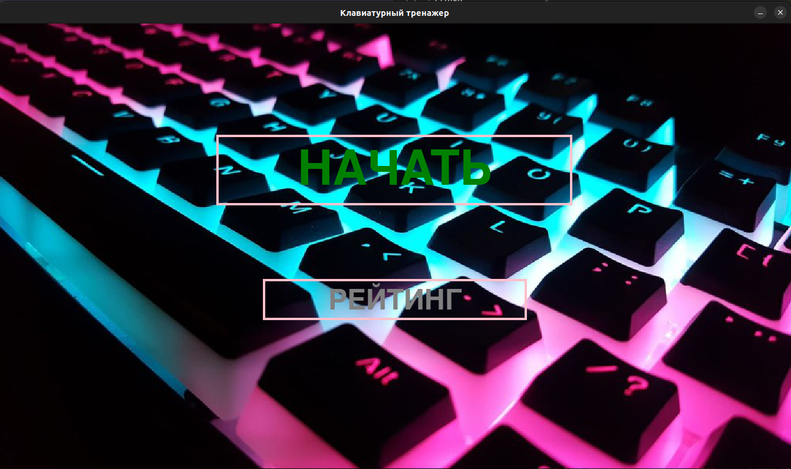

Клавиатурный тренажёр

Базовый функционал:  
Интерфейс: строка, которую человеку надо напечатать и поле для ввода. Не давать печатать неправильные символы  
Разработка формата для заданий и загрузка файлов в этом формате  
Подсчет количества ошибок и скорости печати, сохранение статистики между запусками  

Дополнительный функционал:  
Графический интерфейс  
Отображение статистики во время печати  
Составление heatmap’а клавиш, на которых человек чаще всего ошибается  

Запуск программы осуществляется следующим образом:
python3 main.py
